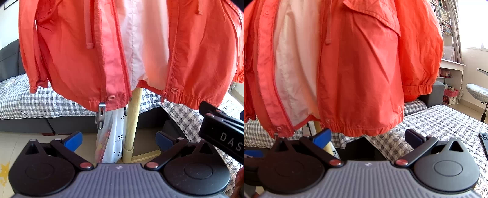

# 10Kh RealOmni-Open MCAP Tools

[](https://www.python.org/downloads/)
[](LICENSE)

English | [中文](./README_zh.md)

Tools for extracting and processing video data from [10Kh RealOmni-Open DataSet](https://www.genrobot.ai/data/open-dataset) MCAP files.



## Overview

The RealOmni-Open Dataset stores multi-modal robot sensor data in [MCAP](https://mcap.dev/) format. Each `.mcap` file contains H.264-encoded video streams (as `foxglove.CompressedImage` protobuf messages) from multiple robot cameras.

This toolkit provides scripts to:
- **Extract** H.264 video streams from MCAP files
- **Convert** to MP4 video and/or JPEG frame sequences via ffmpeg
- **Concatenate** stereo camera pairs into side-by-side images

## Prerequisites

- Python >= 3.8
- [ffmpeg](https://ffmpeg.org/) (system-installed)

```bash
# Install ffmpeg
brew install ffmpeg        # macOS
sudo apt install ffmpeg    # Ubuntu/Debian

# Install Python dependencies
pip install -r requirements.txt
```

## Quick Start

```bash
# Process an MCAP file (auto-detects all camera topics, outputs MP4 + JPEG frames)
python scripts/run_pipeline.py --mcap path/to/00001.mcap

# Also generate concatenated stereo images
python scripts/run_pipeline.py --mcap path/to/00001.mcap --concat

# Extract JPEG frames only
python scripts/run_pipeline.py --mcap path/to/00001.mcap --mode jpg

# Custom output directory and frame rate
python scripts/run_pipeline.py --mcap path/to/00001.mcap --out-dir ./output --fps 30
```

## Output Structure

```
output/
├── robot0_camera0/
│   ├── frames/
│   │   ├── 000001.jpg
│   │   ├── 000002.jpg
│   │   └── ...
│   └── output.mp4
├── robot1_camera0/
│   ├── frames/
│   │   └── ...
│   └── output.mp4
└── concat_robot0_camera0_robot1_camera0/   # with --concat
    ├── 000001.jpg
    └── ...
```

## Scripts Reference

| Script | Description |
|--------|-------------|
| `scripts/run_pipeline.py` | Unified entry point — auto-discovers topics and runs the full pipeline |
| `scripts/extract_h264.py` | Core extraction — dumps H.264 from MCAP, converts to MP4/JPEG via ffmpeg |
| `scripts/concat_frames.py` | Post-processing — concatenates stereo frame pairs side-by-side |
| `scripts/list_topics.py` | Utility — lists all topics in an MCAP file |
| `scripts/count_messages.py` | Utility — counts messages per topic |
| `scripts/inspect_messages.py` | Debug — inspects raw image message bytes |

## Detailed Usage

### Unified Pipeline

```bash
python scripts/run_pipeline.py --mcap <file> [OPTIONS]
```

| Option | Default | Description |
|--------|---------|-------------|
| `--mcap` | (required) | Input `.mcap` file path |
| `--fps` | `30` | Output frame rate |
| `--mode` | `both` | Output mode: `mp4`, `jpg`, `both`, `h264` |
| `--concat` | off | Concatenate stereo pairs side-by-side |
| `--out-dir` | MCAP file directory | Base output directory |
| `--topics` | auto-detect | Specific topics to extract |

### Single Topic Extraction

```bash
python scripts/extract_h264.py \
  --mcap 00001.mcap \
  --topic /robot0/sensor/camera0/compressed \
  --out robot0_camera0 \
  --mode both \
  --fps 30
```

| Option | Default | Description |
|--------|---------|-------------|
| `--mcap` | (required) | Input `.mcap` file path |
| `--topic` | (required) | H.264 CompressedImage topic name |
| `--out` | (required) | Output directory |
| `--fps` | `30` | Output frame rate |
| `--mode` | `both` | `mp4`, `jpg`, `both`, or `h264` |
| `--keep_h264` | off | Keep intermediate `.h264` stream file |
| `--max_packets` | all | Extract only first N packets (for debugging) |

### Frame Concatenation

```bash
python scripts/concat_frames.py \
  --left robot0_camera0/frames \
  --right robot1_camera0/frames \
  --out concat_output
```

### Inspection Utilities

```bash
# List all topics in an MCAP file
python scripts/list_topics.py 00001.mcap

# Count messages per topic
python scripts/count_messages.py 00001.mcap

# Inspect raw message data (first 5 messages)
python scripts/inspect_messages.py --mcap 00001.mcap --topic /robot0/sensor/camera0/compressed --num 5
```

## Processing Pipeline

```
input.mcap
│
├─ [Auto-discover camera topics]
│   e.g. /robot0/sensor/camera0/compressed
│        /robot1/sensor/camera0/compressed
│
├─ Extract H.264 stream ──► robot0_camera0/stream.h264 (temporary)
│   ├─ ffmpeg ──► robot0_camera0/output.mp4
│   └─ ffmpeg ──► robot0_camera0/frames/%06d.jpg
│
├─ Extract H.264 stream ──► robot1_camera0/stream.h264 (temporary)
│   ├─ ffmpeg ──► robot1_camera0/output.mp4
│   └─ ffmpeg ──► robot1_camera0/frames/%06d.jpg
│
└─ [Optional] Concatenate stereo pairs
    └─ concat_robot0_camera0_robot1_camera0/%06d.jpg
```

## Data Format Notes

- **MCAP**: Binary container for time-series sensor data ([spec](https://mcap.dev/spec))
- **Message schema**: `foxglove.CompressedImage` (protobuf encoding)
- **Video codec**: H.264, Annex-B format (NAL units with `0x00000001` start codes)
- **Topic pattern**: `/robot{N}/sensor/camera{M}/compressed`

## License

[MIT](LICENSE)
